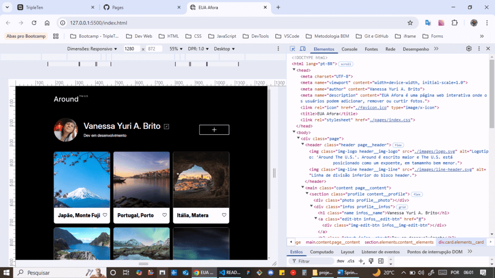
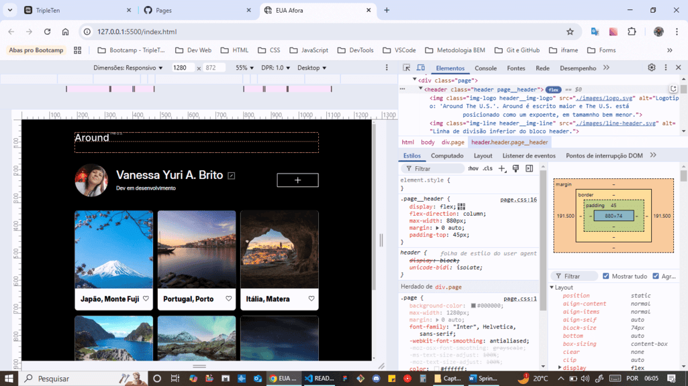
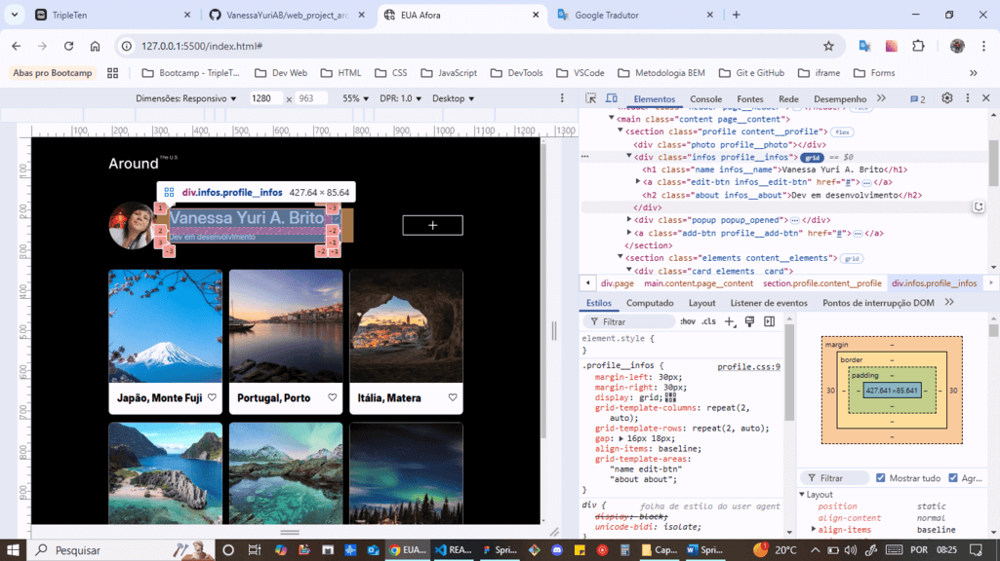
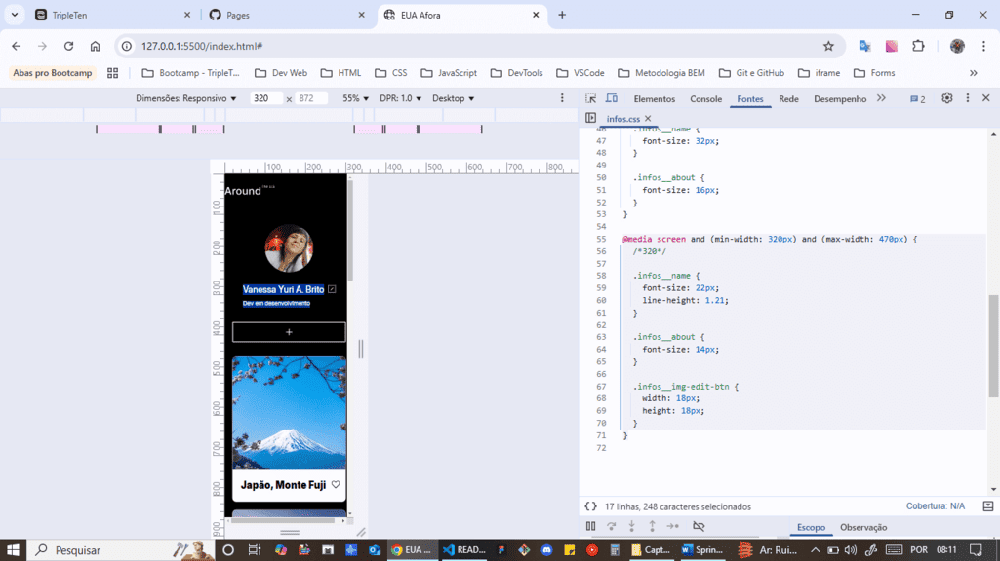
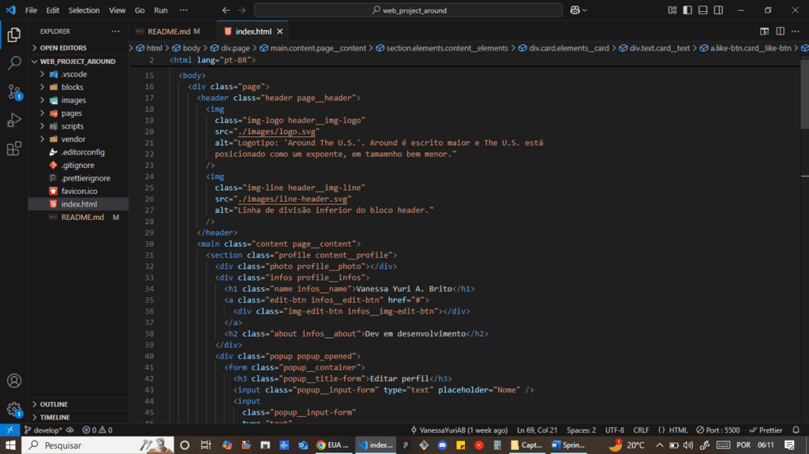
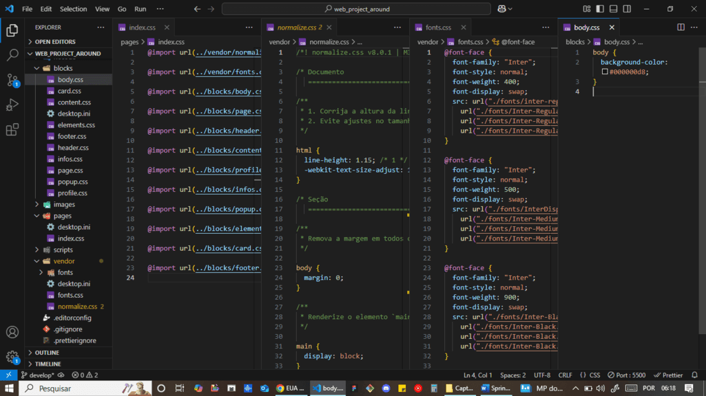
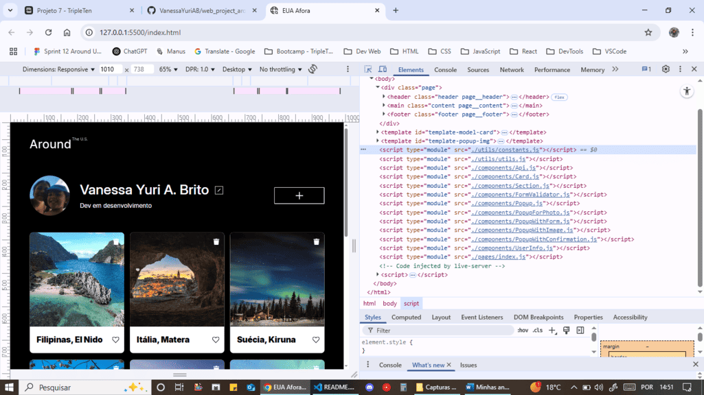
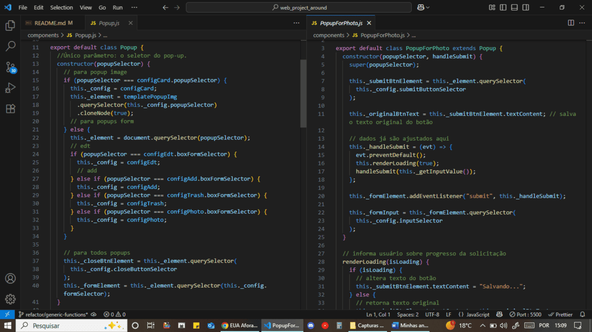
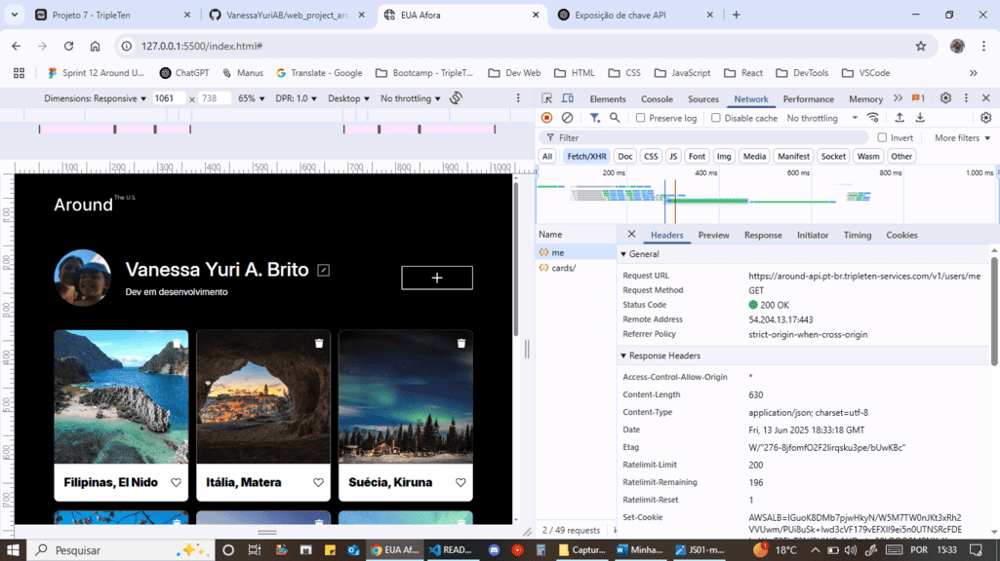

# 🗺️ Around — EUA Afora (Vanilla JavaScript)

**Around (EUA Afora)** é uma aplicação web interativa onde usuários podem **editar o**
**perfil, adicionar, curtir e remover cartões de fotos**, com persistência de dados via
**`API REST`**.

Este projeto foi desenvolvido ao longo das **Sprints 7 a 12** do bootcamp de
**Desenvolvimento Web da TripleTen**, representando a evolução completa de um front‑end
moderno em **`JavaScript` puro**, desde **manipulação básica do `DOM`** até
**`Programação Orientada a Objetos` avançada** e **integração com `API`**.

🔹 Projeto **âncora** do bootcamp

🔹 Base utilizada posteriormente para versões **`React`**, **`Auth`** e **`Full Stack`**

🔹 Primeiro projeto integrando **`JavaScript`**, **`POO`** e **`consumo de API`**

🔹 Segundo projeto com foco em **design responsivo** (layouts definidos em `Figma`)

---

## 📌 Escopo do projeto (Sprints 7 → 12)

Neste repositório está a **versão final do Around em `JavaScript Vanilla`**, contemplando:

- Interface responsiva baseada em layout do `Figma`
- Interação completa com usuário (`CRUD` de cartões)
- Arquitetura modular e orientada a objetos
- Integração com `API` externa
- Foco em boas práticas, legibilidade e escalabilidade

---

## 📈 Evolução técnica por sprints

**Sprints abordadas:**

- Sprint 7 - JS Básico e Trabalho com o DOM
- Sprint 8 - Lógica de Programação JS e Métodos
- Sprint 9 - Objetos e Manipulação de Eventos em JS
- Sprint 10 - Introdução à Programação Orientada a Objetos
- Sprint 11 - POO avançado e NPM
- Sprint 12 - JavaScript Assíncrono e Trabalho com APIs

### 🟢 Sprints 7–8 — Base e interatividade

- `HTML` semântico e `CSS` responsivo (`BEM` / `BEM Flat`)
- Manipulação do `DOM` e eventos
- Popups (editar perfil, adicionar cartão, imagem ampliada)
- Renderização dinâmica de cartões
- Curtidas e remoção de cartões (`front‑end`)

### 🟡 Sprint 9 — UX e validação

- Validação de formulários (`HTML5` + `JS`)
- Controle de estado do botão `submit`
- Fechamento de popups por `Esc` e clique na sobreposição
- Código mais reutilizável e organizado

### 🔵 Sprint 10 — Introdução à POO

- Refatoração completa para `classes ES6`
- Criação das classes:
  - `Card`
  - `FormValidator`
- Modularização com `import` / `export`
- Separação clara de responsabilidades

### 🟣 Sprint 11 — Arquitetura orientada a objetos

- Criação de classes reutilizáveis e especializadas:
  - `Section`
  - `Popup`
  - `PopupWithForm`
  - `PopupWithImage`
  - `UserInfo`
- Uso de `herança`
- Baixo acoplamento entre classes
- `index.js` responsável apenas por orquestração

### 🔴 Sprint 12 — JavaScript assíncrono e API

- Integração completa com `API REST`
- Criação da classe `Api`
- `Fetch assíncrono` com tratamento de erros
- Persistência de dados no servidor:
  - Perfil do usuário
  - Avatar
  - Cartões
  - Curtidas
- Popup de confirmação para exclusão
- Feedback visual de carregamento (`Salvando...`)
- Renderização condicionada após carregamento do usuário

---

## 🧠 Principais conceitos aplicados

- `HTML5` semântico
- `CSS` moderno (`Flexbox`, `Grid`, `Media Queries`)
- `Metodologia BEM` / `BEM Flat`
- `JavaScript` modular (`ES Modules`)
- `Programação Orientada a Objetos` (`ES6 Classes`)
- Herança e encapsulamento
- Baixo acoplamento e responsabilidade única
- `JavaScript` assíncrono (`fetch`, `Promise`, `Promise.all`)
- Consumo de `API REST`
- Controle de estado e `UX`

---

## 🛠️ Tecnologias

- HTML5
- CSS3
- JavaScript (ES6+)
- API REST
- Figma (layout base)

---

## ▶️ Funcionalidades

- ✅ Edição de perfil do usuário
- ✅ Atualização de avatar
- ✅ Adição de cartões
- ✅ Remoção de cartões (com confirmação)
- ✅ Curtir / descurtir cartões
- ✅ Popups acessíveis e reutilizáveis
- ✅ Validação de formulários
- ✅ Persistência via `API`

---

## 📦 Como rodar o projeto localmente

Clone o repositório:

```bash
git clone git@github.com:VanessaYuriAB/web_project_around.git
cd web_project_around
```

Instale as dependências:

```bash
npm install
npm audit
```

⚠️ Este projeto utiliza **`JavaScript` modular**, portanto precisa ser executado em um
servidor local. Opções:

- Extensão `Live Server` (`VS Code`)
- Ou qualquer servidor local simples

---

## ✅ Observações importantes

❗ **Este NÃO é um projeto `React`**

❗ É um projeto **pré‑`React`**, totalmente **modular**, **orientado a objetos** e
**integrado com `API`**

❗ Esta base foi usada posteriormente para os projetos:

- Around (React)
- Around (Auth)
- Around (Full / Monorepo)

> Isso representa evolução progressiva de arquitetura, não uma limitação.

---

## 📷 Detalhes Técnicos

A seguir, alguns exemplos visuais de decisões técnicas e padrões adotados ao longo do
desenvolvimento do projeto (estrutura, organização de estilos, arquitetura `JS` e
integração com `API`).

### 🔹 Estrutura e layout (HTML, Flexbox, Grid, Media Queries)

#### HTML Semântico

Uso de `tags semânticas` (`header`, `main`, `section`, `footer`, etc.) para estruturar a
interface de forma mais clara e acessível. Isso melhora a manutenibilidade do layout,
facilita a leitura do código e apoia boas práticas de acessibilidade (por exemplo,
hierarquia de títulos e uso adequado de elementos de conteúdo).



#### Flexbox

Aplicação de `Flexbox` para organizar componentes e alinhar elementos de forma consistente
(ex.: `header`, área de perfil e elementos internos dos cards). O foco aqui foi garantir
alinhamento previsível, espaçamento correto e adaptação fluida entre diferentes larguras
de tela.



#### Grid Layout

Uso de `CSS Grid` para estruturar áreas onde a organização em linhas e colunas traz mais
controle (ex.: distribuição de cards/galeria). Essa abordagem melhora previsibilidade do
layout em diferentes resoluções e simplifica ajustes de responsividade.



#### Media Queries

Implementação de `Media Queries` para garantir responsividade real conforme os breakpoints
do design no `Figma` (mobile → tablet → desktop). O objetivo foi preservar consistência
visual, evitar rolagem horizontal e manter o layout estável entre pontos de quebra.



---

### 🔹 Organização de estilos (BEM, BEM Flat)

#### Metodologia BEM

Uso da convenção `BEM` (`Block–Element–Modifier`) para nomeação de classes, tornando
explícita a relação entre componentes e suas variações de estado (ex.: botões
desabilitados, cards com estados). Isso reduz conflitos de `CSS` e facilita a evolução do
layout sem “efeitos colaterais”.



#### BEM Flat

Organização do `CSS` em estrutura `BEM Flat`, separando estilos por blocos/componentes
para manter o projeto escalável e navegável. Essa abordagem melhora a manutenção porque
concentra estilos relacionados no mesmo “domínio” do componente, ajudando a evitar
duplicação e regras espalhadas.



---

### 🔹 Arquitetura JS e POO

#### JavaScript

Implementação da interatividade da aplicação com manipulação do `DOM`, eventos e
atualização dinâmica da `UI`: abertura/fechamento de popups, renderização de cards,
estados de curtida, remoção e submissão de formulários. Nesta fase, o projeto evolui para
uma base modular com `ES Modules`, separando responsabilidades e deixando o código mais
fácil de manter.



#### POO

Refatoração para `Programação Orientada a Objetos` usando `classes ES6` para encapsular
responsabilidades e reduzir acoplamento. O projeto passa a trabalhar com componentes
reutilizáveis (`Card`, `Section`, `Popup` e subclasses, `UserInfo`, `FormValidator`),
melhorando a organização e facilitando evolução incremental sem retrabalho.



---

### 🔹 Integração com API

Integração com `API REST` para persistência e sincronização de dados (usuário, avatar,
cards e likes). As requisições assíncronas são centralizadas em uma classe `Api`, com
checagem de respostas e tratamento de erros; o carregamento inicial pode ser orquestrado
com `Promise.all` para buscar usuário e cards em paralelo antes de renderizar a interface.



---

## 🎥 Demonstração em vídeo

📽️ Loom: https://www.loom.com/share/b81efa1bc8124cbab69e3746d445ef3a

---

## 🌐 Deploy

🔗 GitHub Pages: https://vanessayuriab.github.io/web_project_around/

---

## 🚀 Possíveis melhorias futuras

- Tratamento de erros mais robusto nos `catch()`
- Centralização de configurações compartilhadas
- Fábrica para criação de cartões
- Padronização adicional de nomenclatura
- Estratégias para evitar duplicidade de cards no `DOM`
