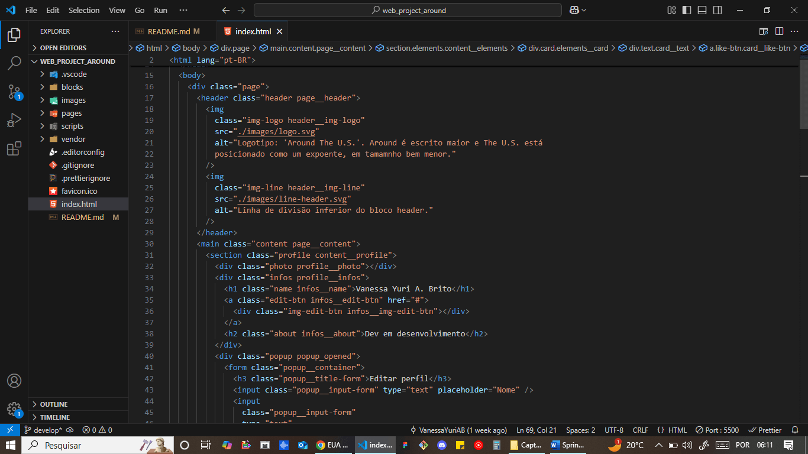

# Web_project_around: EUA Afora

"Around The US" é uma página interativa onde os usuários podem adicionar, remover ou curtir fotos.

Até o momento (22/05/25), são 5 sprints trabalhadas neste projeto (JS Básico e Trabalho com o DOM, Lógica de Programação JS e Métodos, Objetos e Manipulação de Eventos em JS, Introdução à Programação Orientada a Objetos, POO avançado e NPM).

Feita com HTML e CSS avançados, Flexbox, Metodologia BEM / BEM Flat, Figma, Media Queries, Grid Layout, JavaScript e POO.

Primeiro projeto com JS e POO. Segundo design responsivo (com tamanhos de layout fornecidos no projeto).

# Técnicas utilizadas

- HTML Semântico:

  

  

  

- Flexbox:

  

  

  

  

- Metodologia BEM:

  

  

  

  

  

- BEM Flat:

  

  

  

- Media Queries:

  

  

  

  

  

  

  

  

  

- Grid Layout:

  

  

- JavaScript:

  

  

  

  

  

  

  

  

  

  

  

  

  

  - POO:

  

  

  

  

  

  

  

  

  

  

  

  

  

  

  

  

# Link do GitHub Pages

https://vanessayuriab.github.io/web_project_around/

# Melhorias:

- Adicionar funcionalidade para manter as informações editadas e salvas, após atualizar a página.
- Alterar nome de chaves de objetos de configuração: boxFormSelector e formSelector para containerSelector e boxSelector.
- Inserir novo cartão na página via classes Section e Card.
