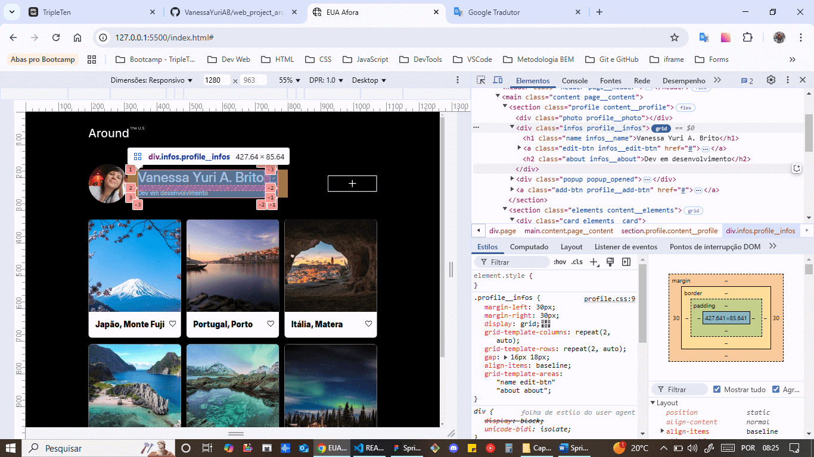

# Web_project_around: EUA Afora

"Around The US" é uma página interativa onde os usuários podem adicionar, remover ou curtir fotos.

Feita com HTML e CSS avançados, Flexbox, Metodologia BEM / BEM Flat, Figma, Media Queries, Grid Layout e JavaScript básico.

Primeiro projeto com JS e segundo design responsivo (com tamanhos de layout fornecidos no projeto).

# Técnicas utilizadas

- HTML semântico:
  
  
  

- Flexbox:
  
  
  
  

- Metodologia BEM:
  
  
  
  
  

- BEM flat:
  
  
  

- Media Queries:
  
  
  
  
  
  
  
  
  

- Grid Layout:
  
  

- JavaScript:
  
  
  
  
  

# Link do GitHub Pages

https://vanessayuriab.github.io/web_project_around/

# Melhorias:

Adicionar funcionalidade para manter as informações editadas e salvas, após atualizar a página.
