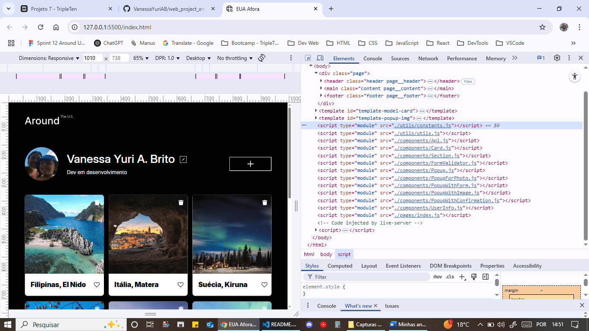
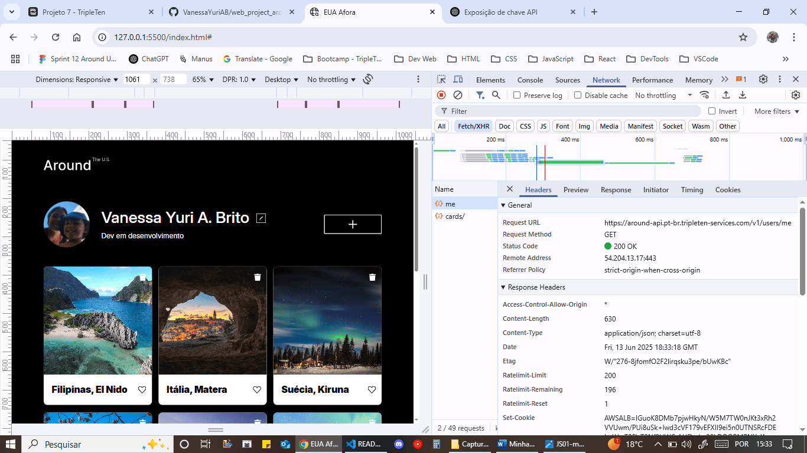

# Web_project_around: EUA Afora

"Around The US" é uma página interativa onde os usuários podem adicionar, remover e curtir fotos.

Até o momento (16/06/25), são 6 sprints trabalhadas neste projeto:

1. JS Básico e Trabalho com o DOM,
2. Lógica de Programação JS e Métodos,
3. Objetos e Manipulação de Eventos em JS,
4. Introdução à Programação Orientada a Objetos,
5. POO avançado e NPM e
6. JavaScript Assíncrono e Trabalho com APIs.

Feita com HTML e CSS avançados, Flexbox, Metodologia BEM / BEM Flat, Figma, Media Queries, Grid Layout, JavaScript (síncrono e assíncrono), POO e API.

Primeiro projeto com JS, POO e API.
Segundo com design responsivo (tamanhos de layout fornecidos no projeto).

# Técnicas utilizadas

## > HTML Semântico: uso de tags HTML que indicam o propósito de cada seção, em vez de apenas definir a estrutura da página.

HTML Semântico 1:

HTML Semântico 2:

HTML Semântico 3:

## > Flexbox: modelo de layout unidimensional do CSS que alinha e distribui itens dentro de um container de forma responsiva, seja em linha ou coluna, facilitando a criação de layouts complexos e adaptáveis a diferentes tamanhos de tela.

Flexbox 1:

Flexbox 2:

Flexbox 3:

Flexbox 4:

## > Metodologia BEM: metodologia de desenvolvimento front-end para melhor organizanização do código CSS - facilita a criação de componentes reutilizáveis e a manutenção do código.

Metodologia BEM 1:

Metodologia BEM 2:

Metodologia BEM 3:

Metodologia BEM 4:

Metodologia BEM 5:

## > BEM Flat: estrutura de arquivos onde cada componente BEM (bloco) tem seu próprio diretório com arquivos HTML, CSS e JavaScript, se necessário, para organização mais limpa e modular do código. A estrutura "flat" é frequentemente usada com BEM para facilitar a manutenção e reutilização.

BEM Flat 1:

BEM Flat 2:

BEM Flat 3:

## > Media Queries: recurso do CSS3 para aplicar estilos específicos a uma página web com base nas características do dispositivo, como tamanho da tela, orientação, resolução, etc. São a base do design responsivo, permite que o site se adapte a diferentes tamanhos de tela e dispositivos.

Media Queries 1:

Media Queries 2:

Media Queries 3:

Media Queries 4:

Media Queries 5:

Media Queries 6:

Media Queries 7:

Media Queries 8:

Media Queries 9:

## > Grid Layout: sistema de layout bidimensional do CSS que permite organizar o conteúdo em linhas e colunas na web. Oferece recursos para a criação de layouts complexos.

Grid Layout 1:

Grid Layout 2:

## > JavaScript: linguagem de programação usada para adicionar interatividade e dinamismo a páginas web e aplicações. É uma das tecnologias fundamentais do desenvolvimento web moderno, junto com HTML e CSS. Pode ser usado no navegador (lado do cliente) e no lado do servidor (com plataformas como Node.js).

JavaScript 1:

JavaScript 2:

JavaScript 3:

JavaScript 4:

JavaScript 5:

JavaScript 6:

JavaScript 7:

JavaScript 8:

JavaScript 9:

JavaScript 10:

JavaScript 11:

JavaScript 12:

## > POO: Programação Orientada a Objetos é um modelo de programação que organiza o código em torno de objetos, em vez de funções ou lógica. Objetos são unidades de código que combinam dados (atributos) e ações (métodos) relacionados.

POO 1:

POO 2:

POO 3:

POO 4:

POO 5:

POO 6:

POO 7:

POO 8:

POO 9:

POO 10:

POO 11:

POO 12:

POO 13:

POO 14:

## > API: Interface de Programação de Aplicações é um conjunto de regras e protocolos que permite que diferentes softwares se comuniquem e compartilhem dados entre si. Atua como um intermediário, facilitando a interação entre diferentes aplicações, sem que elas precisem conhecer os detalhes internos de implementação uma da outra. São ferramentas essenciais para o desenvolvimento moderno de software, permitindo que diferentes sistemas interajam e compartilhem dados de forma eficiente, segura e escalável.

API 1:

API 2:

API 3:

API 4:

API 5:

API 6:

API 7:

API 8:

API 9:

API 10:

API 11:

API 12:

API 13:

API 14:

# Uma demonstração em vídeo do projeto no Loom:

# Link do GitHub Pages:

https://vanessayuriab.github.io/web_project_around/

# Melhorias:

- Processar erros dentro dos catch()'s com lógica mais complexa.
- Adicionar verificação para evitar a duplicação de card na página.
- Melhorar a verificação para links de imagens de cards, para configuração do ícone de lixeira.
- Separar handlers do Popup numa classe ou objeto dedicado.
- Usar uma fábrica para criar cards.
- Centralizar configs e alterar nomes de chaves (consistência na nomenclatura): boxFormSelector e formSelector para containerSelector e boxSelector, por exemplo.
